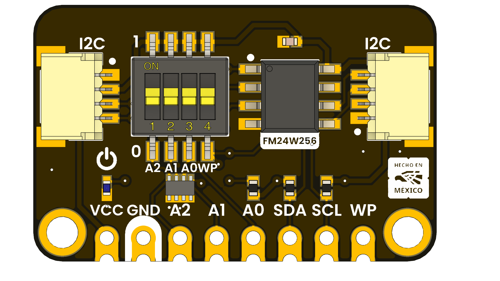

# DevLab: I2C FRAM FM24W256 Module

## Introduction

The FM24W256 module integrates a 256Kbit (32K x 8) I2C FRAM (Ferroelectric RAM) chip, providing a robust and efficient non-volatile memory solution for embedded applications. Designed for high-speed data access and low power operation, the module supports frequent and rapid read/write cycles with exceptional endurance. Unlike traditional EEPROM and other non-volatile memories, the FM24W256 ensures reliable data retention for up to 151 years, while minimizing system complexity and eliminating common reliability concerns. This makes it particularly suitable for data logging, configuration storage, and real-time data buffering in demanding embedded environments.

  
  
  
  
   

  
  
<em>FM24W256 I2C FRAM Module</em>

### Quick Setup

## Overview

| Feature                      | Description                        |
|------------------------------|------------------------------------|
| Memory Size                  | 256Kbit (32K x 8)                  |
| Interface                    | I2C (up to 400kHz)                 |
| Operating Voltage            | 2.7V to 5.5V                       |
| Endurance                    | 10^14 write cycles                  |
| Data Retention               | 151 years                          |
| Operating Temperature Range  | -40°C to +85°C                     |

## Applications
- Extending I2C communication range
- Improving signal integrity in noisy environments
- Industrial automation systems
- Sensor networks
- Home automation systems

## Resources
- [Product Wiki](#)
- [Datasheet](#)

## License

This product and its documentation are licensed under the MIT License.  
See [`LICENSE.md`](LICENSE.md) for details.

  Template by UNIT Electronics 

