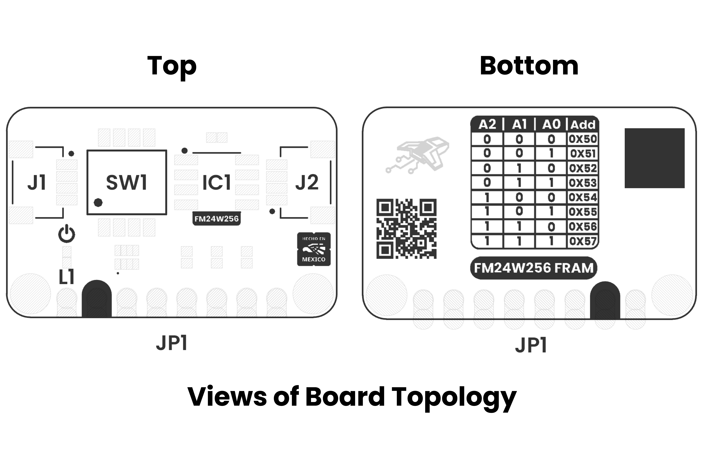
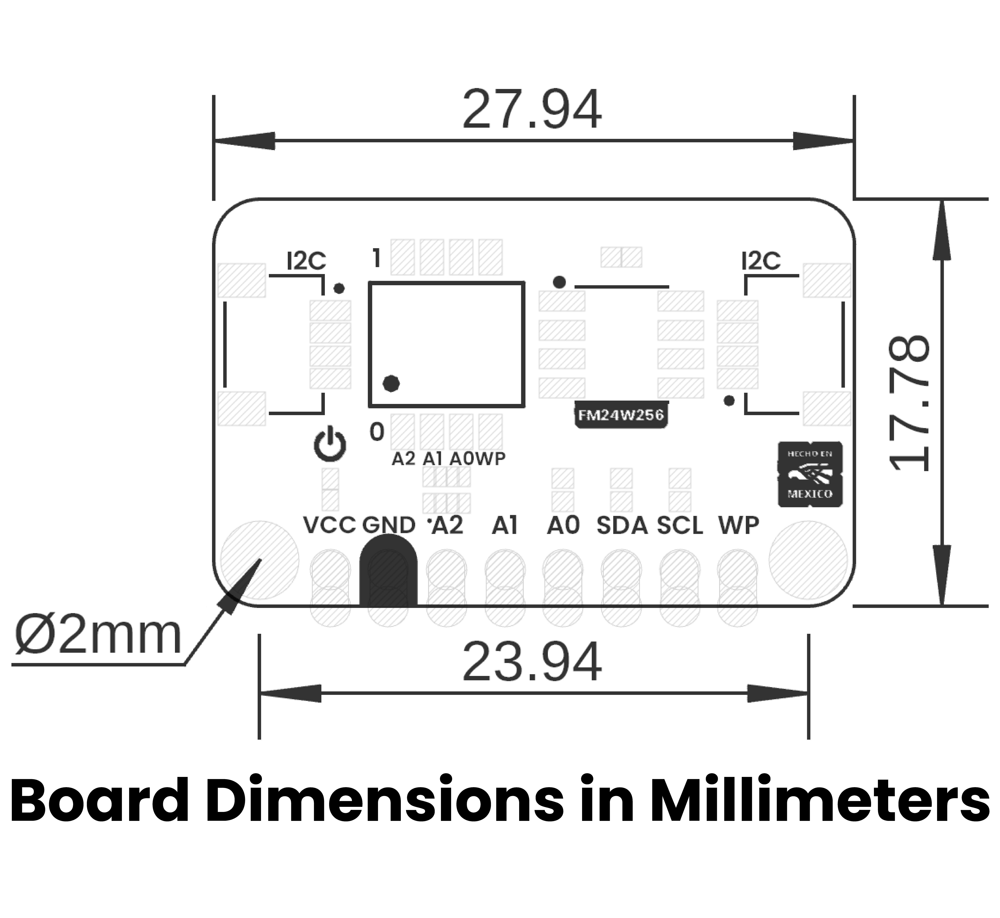

# Hardware

<a href="./unit_sch_v_1_0_0_ue0111_fm24w256_fram_module.pdf"> Schematic</a>

## Overview

| Feature                                              | Description                                              |
|------------------------------------------------------|----------------------------------------------------------|
| Memory Type                                          | FM24W256 I2C FRAM for dependable non-volatile storage    |
| Interface                                            | Standard I2C (2-wire) for straightforward integration    |
| Operating Voltage                                    | 2.7V to 5.5V for flexible power compatibility            |
| I2C Speed                                            | Supports fast communication up to 400 kHz                |

## Technical Specifications

### Electrical Characteristics

| **Parameter** |              **Description**               | **Min** | **Typ** | **Max** | **Unit** |
|:-------------:|:------------------------------------------:|:-------:|:-------:|:-------:|:--------:|
|      Vdd      |    Input voltage to power on the module    |   2.7   |   3.3   |   5.5   |    V     |
|      Idd      |               Supply current               |    100    |    -    |   400   |    uA    |
|      Ili      | Input Leakage Current (Except WP and A2-A0) |   -1    |    0    |   +1    |    uA    |
| | Input Leakage Current (for WP and A2-A0) |-1  | - | +100 | uA |  
|      Ilo      | Output Leakage Current (Except WP and A2-A0) |   -1    |    0    |   +1    |    uA    |
|    Vih    |     Input High voltage      |    0.7xVdd    |   -    |   Vdd+0.3   |    V    |
|      Vil      |    Input Low voltage     |    -0.3    |    -    |  0.3xVdd   |    V     |
|      Vol      |            Output Low voltage             |    -    |    -    |  0.4V   |    V     |
|     Tdr*     |              Data retention              |    10    | -  |    151    |   Years   |
| NVc | Endurance | 10^14 | - | - | Cycles |

*<b>Note: </b> Data retention depends on the ambient temperature, for more information please refer to FM24W256 manufacturer datasheet.

## Pinout

    <a href="#"> Pinout</a>
     
     
     

### Pin & Connector Layout
| Pin   | Voltage Level | Function                                                  |
|-------|---------------|-----------------------------------------------------------|
| VCC   | 3.3 V – 5.5 V | Provides power to the on-board regulator and sensor core. |
| GND   | 0 V           | Common reference for power and signals.                   |
| SDA   | 1.8 V to VCC  | Serial data line for I²C communications.                  |
| SCL   | 1.8 V to VCC  | Serial clock line for I²C communications.                 |

> **Note:** The module also includes a Qwiic/STEMMA QT connector carrying the same four signals (VCC, GND, SDA, SCL) for effortless daisy-chaining.

## Topology

<a href="./resources/unit_topology_v_1_0_0_ue0111_fm24w256_fram_module.png">  Topology</a>
 
 
 

| Ref. | Description                              |
|------|------------------------------------------|
| IC1  | FM24W256 FRAM                            |
| L1   | Power On LED                             | 
| JP1  | 2.54 mm Castellated Holes                |
| SW1  | Dip Switch for Configuration             |
| J1   | QWIIC Connector (JST 1 mm pitch) for I2C |
| J2   | QWIIC Connector (JST 1 mm pitch) for I2C |

## Dimensions

<a href="./resources/unit_dimension_v_1_0_0_ue0111_fm24w256_fram_module.png">  Dimensions</a>

# References

- <a href="https://www.infineon.com/assets/row/public/documents/10/49/infineon-fm24w256-256-kbit-32k-x-8-serial-i2c-f-ram-datasheet-en.pdf?fileId=8ac78c8c7d0d8da4017d0ec9dd494223"> FM24W256 Datasheet </a>
